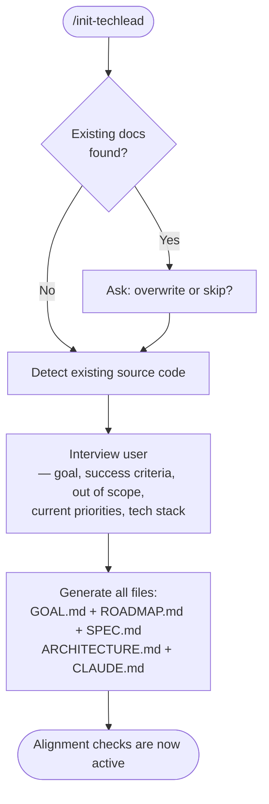
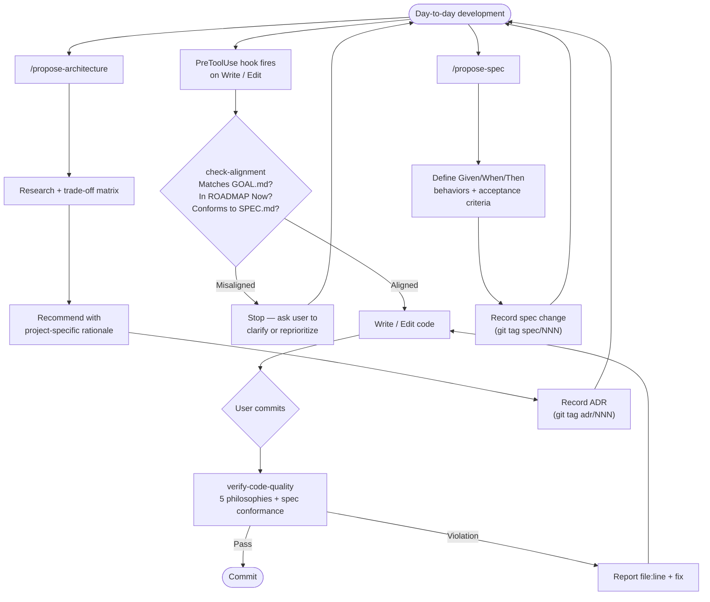

# Techlead

A Claude Code plugin that acts as a strict, pragmatic senior developer — enforcing project discipline through 5 core philosophies.

## What It Does

Techlead automatically checks your work against five principles:

1. **Single Goal** — Every project has one goal (`GOAL.md`). Code that doesn't serve it gets questioned.
2. **YAGNI** — No speculative abstractions. Write the simplest thing that works.
3. **Context-Aware Decisions** — Every architectural choice is recorded in an ADR with project-specific reasoning.
4. **High Cohesion / Low Coupling** — Feature modules don't import each other. Cross-cutting logic goes through `core/`.
5. **Fail Fast** — No `TODO`/`FIXME`/`HACK` in committed code. Errors are handled, not swallowed.

See [The 5 Philosophies](docs/philosophy.md) for definitions, rationale, and anti-patterns.

## Installation

```bash
claude plugin add /path/to/techlead
```

Or use the plugin directory flag:

```bash
claude --plugin-dir /path/to/techlead
```

## Quick Start

After installing, run the init command in any project:

```
/init-techlead
```

This creates:

```
your-project/
├── GOAL.md              # Single project goal + success criteria
├── ROADMAP.md           # Now / Next / Later milestones
├── SPEC.md              # User-observable behaviors + acceptance criteria
├── ARCHITECTURE.md      # Tech stack, module structure, import rules
└── CLAUDE.md            # Updated with Techlead rules
```

ADRs are stored as git commits with `adr/` tags — no file bloat. Discover them via `git tag -l "adr/*"` and read via `git log <tag> --format="%B" -1`. Spec records use the same pattern with `spec/` tags.

From that point on, Techlead is active. It checks alignment before code changes and verifies quality before commits.

## Workflow

### Setup



### After Setup



## How It Works

### Skills

| Skill | When | What |
|-------|------|------|
| **techlead-persona** | Always active | Sets the pragmatic senior developer tone and philosophy |
| **check-alignment** | Before writing/editing code | Verifies the task matches GOAL.md, ROADMAP.md, and SPEC.md |
| **verify-code-quality** | Before commits | Checks code against all 5 philosophies + spec conformance |
| **init-techlead** | `/init-techlead` | Bootstrap GOAL.md, ROADMAP.md, SPEC.md, ARCHITECTURE.md, CLAUDE.md |
| **propose-architecture** | `/propose-architecture` or "compare A vs B" | Research, trade-off matrix, recommendation, and ADR recording |
| **propose-spec** | `/propose-spec` or "what should X do?" | Define feature specs as user-observable Given/When/Then behaviors |
| **read-history** | `/read-history` | Search and display ADRs and spec records from git tags |

### Hooks

A `PreToolUse` hook fires before every `Write` or `Edit` tool call, prompting Claude to verify alignment with GOAL.md, ROADMAP.md, and SPEC.md before making changes.

## Evaluation (Developer)

Techlead includes an eval framework for plugin developers to verify that skills work correctly. There are two eval types:

**Trigger evals** test whether a skill's description causes Claude to invoke it for the right queries (and not invoke it for unrelated ones). Each skill has a `trigger_evals.json` with labeled queries.

```
/eval-trigger <skill-name>
```

**Behavioral evals** test whether a skill produces correct output by running paired agents (with-skill vs without-skill) in isolated worktrees and grading against assertions. Each skill has an `evals.json` with prompts, expected outputs, and assertions.

```
/eval-behavior <skill-name>
```

**Metrics:**
- Trigger accuracy % — how often the skill fires (or doesn't) correctly
- Behavioral delta % — pass rate difference between with-skill and without-skill runs

## Document Hierarchy

Techlead uses a layered document system, read in priority order:

```
GOAL.md          →  WHY   — What we're building and what's out of scope
ROADMAP.md       →  WHEN  — What to work on now vs. later
SPEC.md          →  WHAT  — User-observable behaviors and acceptance criteria
ARCHITECTURE.md  →  HOW   — How the system is structured
ADR tags (adr/*) →  Architectural decision records (git commit messages)
Spec tags (spec/*) → Spec change records (git commit messages)
```

The key rule: **only items in ROADMAP.md's "Now" section get worked on.** Everything else waits.

## Project Structure

```
techlead/
├── .claude-plugin/
│   └── plugin.json                  # Plugin metadata
├── skills/
│   ├── techlead-persona/
│   │   ├── SKILL.md                 # Core persona + philosophies
│   │   └── evals/                   # Trigger + behavioral evals
│   ├── check-alignment/
│   │   ├── SKILL.md                 # Goal/roadmap alignment gate
│   │   └── evals/                   # Evals + fixtures (GOAL.md, ROADMAP.md)
│   ├── verify-code-quality/
│   │   ├── SKILL.md                 # Code quality verification
│   │   └── evals/                   # Evals + fixtures (GOAL.md, ROADMAP.md, ARCHITECTURE.md)
│   ├── init-techlead/
│   │   └── SKILL.md                 # Project bootstrapping
│   ├── propose-architecture/
│   │   ├── SKILL.md                 # Architectural decisions + trade-off research
│   │   └── evals/                   # Evals + fixtures (GOAL.md, ROADMAP.md, ARCHITECTURE.md)
│   ├── propose-spec/
│   │   ├── SKILL.md                 # Feature spec definition + behavioral outcomes
│   │   └── evals/                   # Evals + fixtures (GOAL.md, ROADMAP.md, SPEC.md)
│   └── read-history/
│       └── SKILL.md                 # ADR + spec record lookup
├── .claude/
│   └── commands/
│       ├── eval-trigger.md          # Trigger eval runner (developer)
│       └── eval-behavior.md         # Behavioral eval runner (developer)
├── docs/
│   ├── guide.md                     # User guide and workflow
│   └── philosophy.md                # The 5 philosophies deep reference
├── hooks/
│   └── hooks.json                   # Pre-write alignment check
└── templates/
    ├── CLAUDE.md.template
    ├── GOAL.md.template
    ├── ROADMAP.md.template
    ├── SPEC.md.template
    ├── ARCHITECTURE.md.template
    ├── adr-template.md
    └── spec-record-template.md
```

## License

MIT
